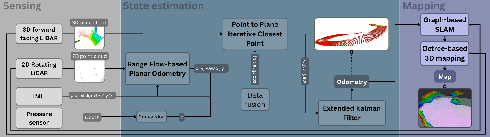

# Autonomous Navigation in Cluttered Littoral Environments

## Perception Pipeline

**Multi lidar inertial SLAM**

## Instructions:

### Using the packages

The pipeline can be eiter used within a Gazebo simulation [[AUV Simulation Package](./src/auv_simulation_pkg)] or directly with sensors [[ANCLE Package](./src/ancle_pkg)]. Both package are assiocated with a docker image for a smooth set up, images are specifically built for ARM64 system such as Jetson Nano. Specific intructions on docker and package use can be found within corresponding folders.

### Running the pipeline from an external computer

The code can be run and visualized from an other computer while the Jetson is on board of the vehicle. The complete tutorial is available here: [[NUC Testing](./tools/NUC_testing)]

