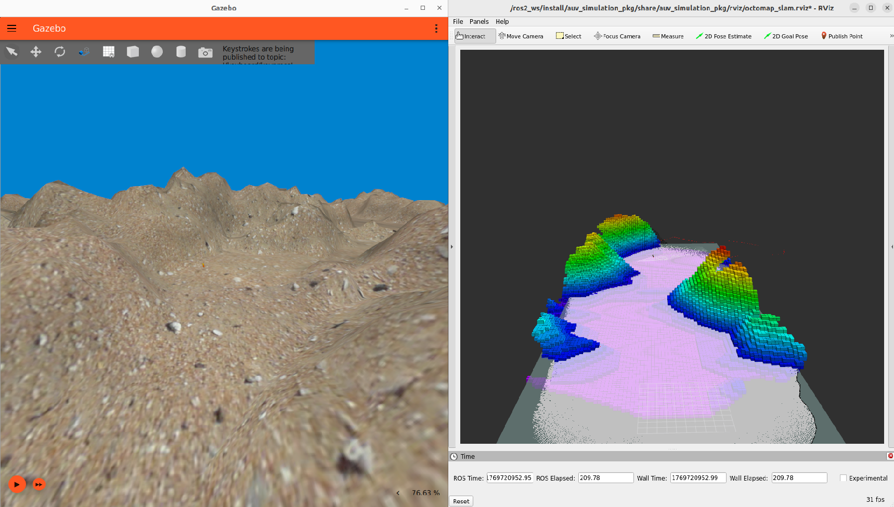

# AUV simulation package

Simulation of an AUV in an underwater environment to test the ANCLE perception pipeline.



## Docker stuff:

Build the docker container from the ANCLE main folder:

```bash
docker build -f tools/Docker/dockerfile_ros_humble_auv_simulation/Dockerfile  -t ancle_auv_simulation_humble_image .
```

Run the container: 

```bash
docker run -it --rm\
  --net=host \
  --env="DISPLAY=$DISPLAY" \
  --env="QT_X11_NO_MITSHM=1" \
  --env="XAUTHORITY=$XAUTH" \
  --volume="/tmp/.X11-unix:/tmp/. X11-unix:rw" \
  --runtime nvidia \
  --gpus all \
  --name ancle_auv_simulation_humble_container \
  ancle_auv_simulation_humble_image \
  bash
```

Run the same container in a new window:

```bash
docker exec -it ancle_auv_simulation_humble_container bash
```
## Running the simulation and the pipeline
### Launch Gazebo only

```bash
ros2 launch auv_simulation_pkg gazebo_only.launch.py 
```

### Launch simulation only

```bash
ros2 launch auv_simulation_pkg sim3D.launch.py 
```

### Launch SLAM

```bash
ros2 launch auv_simulation_pkg sim.slam.launch.py 
```

Then, once rviz and gazebo are set up:

```bash
ros2 launch auv_simulation_pkg slam.launch.py
```

### Launch SLAM + Octomap

```bash
ros2 launch auv_simulation_pkg sim.octomap.slam.launch.py 
```

Then, once rviz and gazebo are set up:

```bash
ros2 launch auv_simulation_pkg octomap.slam.launch.py 
```

## Evaluation

### Saving paths

While running the simulation and the pipeline, paths can be saved into some text files. To save the ground truth trajectory use:

```bash
python3 /tools/python_src/ground_truth_pose_node.py 
```

To record the output of the whole odometry pipeline:

```bash
python3 /tools/python_src/save_odom.py /odometry/filtered
```

Topic argument can be change in order to record odometry sent by intermediate part of the pipeline such as ICP (/icp_odom) or RF2O (/odom_rf2o_projected)

### Ploting

```bash
python3 /tools/python_src/plot_trajectory.py <trajectory txt file>
```

### Computing statitics

```bash
python3 /tools/python_src/compute_ate/evaluation_ate.py \
				<ground truth trajectory txt file> \
				<estimated trajectory txt file> \
				--plot <plot_name>
        --verbose
```