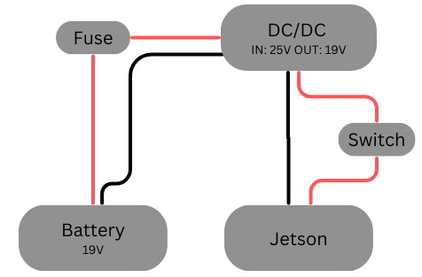

# Running rviz on another computer

Another docker image has been created in order to visualize output from the pipeline directly on another computer (using ROS communication over WIFI).

## Init docker container

Build the docker container from the ANCLE main folder:

```bash
docker build -f tools/NUC_testing/Dockerfile  -t ancle_ext_viz_image .
```

# Testing set up
## Jetson Electrical wiring:



## Setting up Jetson

- Plug in jetson and NUC (make sure NUC is on Hotspot)
- Wait for a few minutes, then ssh to jetson from NUC:

```bash
 ssh robotuna@robotuna-jetson.local
```

Control the Jetson from this NUC terminal window from now

## Wiring:

- Plug RPLiDAR and cyglidar via USB and check that udev rules are up:

```bash
ls -l /dev|grep ttyUSB
```

Expected output:

```bash
lrwxrwxrwx  1 root     root             7 Dec 11 10:40 cyglidar -> ttyUSB1
lrwxrwxrwx  1 root     root             7 Dec 11 10:40 rplidar -> ttyUSB0
crwxrwxrwx  1 root     dialout 188,     0 Dec 11 10:40 ttyUSB0
crwxrwxrwx  1 root     dialout 188,     1 Dec 11 10:40 ttyUSB1
```

- Wire IMU on Jetson pins:
- VCC → pin 1 (3.3V)
- GND → pin 6 (GND)
- SCL (yellow) → pin 5
- SDA (green) → pin 3


## Launching docker

```bash
docker run -it --rm \
	--net=host \
	--env="DISPLAY=$DISPLAY" \
	--env="QT_X11_NO_MITSHM=1" \
	--env="XAUTHORITY=$XAUTH" \
	--volume="/tmp/.X11-unix:/tmp/. X11-unix:rw" \
	--runtime nvidia \
	--gpus all \
	--device=/dev/cyglidar:/dev/cyglidar \
	--device=/dev/rplidar:/dev/rplidar \
	--device=$(readlink -f /dev/cyglidar) \
	--device=$(readlink -f /dev/rplidar) \
	--device=/dev/i2c-7:/dev/i2c-7 \
	--name ancle_humble_container \
	ancle_humble_image \
	bash
```

### Export ROS domain ID

```bash
export ROS_DOMAIN_ID=12
```

## Launching ANCLE pipeline

Full pipeline no rviz

```bash
ros2 launch ancle_pkg ancle.launch.py mapping:=true use_rviz:=false
```

Arguments:

mapping: Launch the mapping part of the pipeline, default false

use_rviz: Wether to launch rviz on jetson or not, default to true

# Visualise on NUC

Allow visualization from docker:

```bash
xhost +local:docker
```

Start the ROS2 humble container on NUC:

```bash
docker run -it --rm\
  --net=host \
  --env="DISPLAY=$DISPLAY" \
  --volume="/tmp/.X11-unix:/tmp/. X11-unix:rw" \
  -v /home/seagrant-nuc/docker_shared:/docker_shared \
  --name ancle_ext_viz_container \
  ancle_ext_viz_image \
  bash
```

Export ROS domain ID:

```bash
export ROS_DOMAIN_ID=12
```

Start RVIZ using config file:

```bash
ros2 run rviz2 rviz2 -d /docker_shared/rviz_octomap_slam.rviz
```

